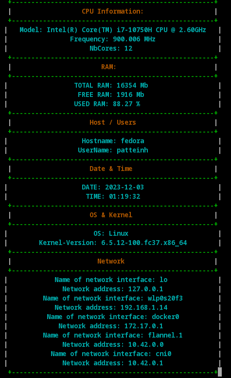
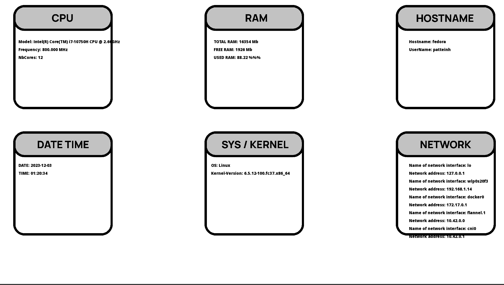

# My_GKrellm 🖥️

Welcome to **My_GKrellm**.

This project challenges you to create a clone of the GKrellM system monitor, showcasing your skills in C++ and GUI programming.

## Language and Tools 🛠️

- **Language:** C++
- **Compilation:** Via Makefile, including `re`, `clean`, and `fclean` rules.
- **Library:** `ncurses` for terminal graphics.
- **Binary Name:** MyGKrellm

## Project Overview 📜

The goal is to develop a system monitor that can be run in both text and graphical modes, providing various system information through customizable modules.

The project is divided into core steps and a bonus step, with each step needing to be completed perfectly before proceeding to the next.

### Core Steps

1. **Monitor Core and Basic Modules:** Implement the core of the monitor and basic modules like `hostname/username, operating system/kernel version, and date/time`.
2. **Advanced Modules:** Develop modules for `CPU (model, frequency, cores, activity) and RAM`.
3. **Network Load Module:** Create a module to monitor network load.

### Display Modes

- **Text Mode:** Utilize libraries like `nCurses`for terminal display.
- **Graphical Mode:** Use `SFML` for a graphical window display.

### Design and Interfaces

- **IMonitorModule:** Describes the behavior of a monitor module.
- **IMonitorDisplay:** Describes a display mode of the monitor.
- **Configurability:** Modules should be configurable at different levels, with the highest level allowing runtime configuration and modification.

## MyGKrellm Previews 📸

## Installation and Usage 💾

1. Clone the repository.
2. Compile the project using the provided Makefile.
3. Run the program: `./MyGKrellm [text | graphical]`.
4. For detailed guidelines, refer to `MyGKrellm.pdf`.

## License ⚖️

This project is released under the MIT License. See `LICENSE` for more details.
